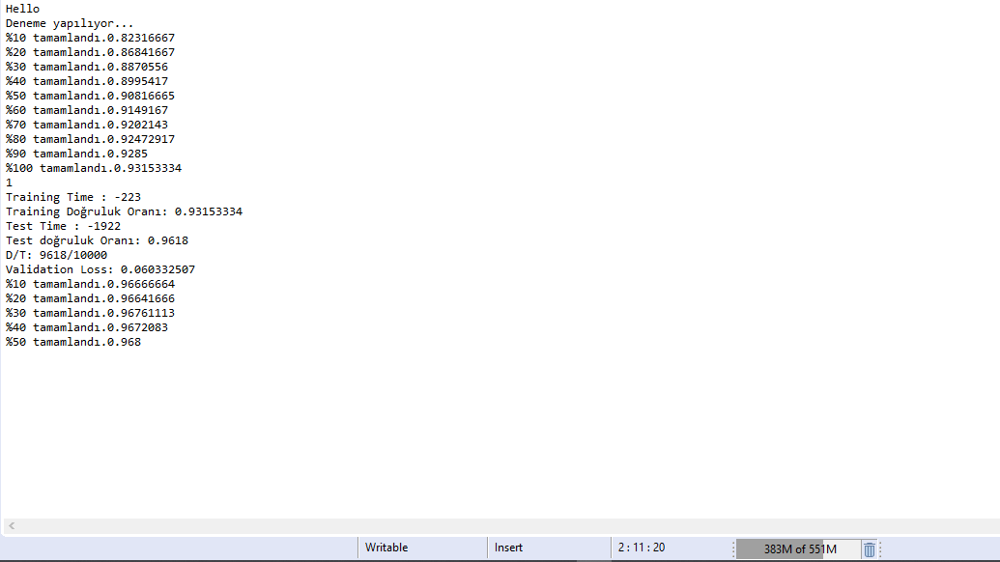

# myMDAI
Backpropagation algorithm on Java

The main algorithm is at AI package. In MDAI class there is example of MNIST DATASET.

Dense, 128-128 hidden layers, below outputs for  1 epoch example on MNIST Dataset;

